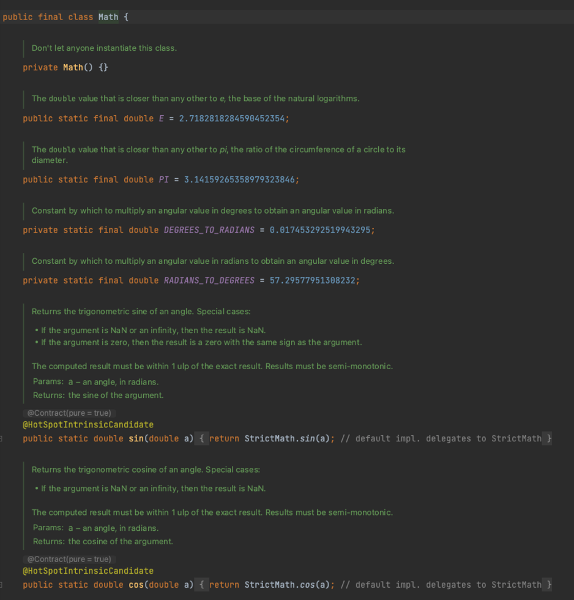
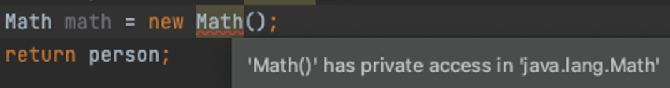

## 아이템 4 인스턴스화를 막으려거든 private 생성자를 사용하라

정적 메서드나 정적 필드만 담은 클래스가 있다

1. Math, Array는 기본 타입값이나 배열관련 메서드들을 모아놓았다 코드 까보면

보면 모든 메서드가 static으로 되어있고 생성자는 private Math() {} 으로 되어있다 우리가 Math 를 사용할떄 Math math = new Math로 사용하지 않고 무조건 정적 팩토리 메서드로 사용한다

1. 특정 인터페이스를 구현하는 객체를 생성해주는 정적 메서드(혹은 팩토리)를 모은 클래스

이또한 Math처럼 전부 static, private생성자가 있다

1. final 클래스와 관련된 메서드들을 모아놓을 때

final클래스를 상속해서 하위 클래스에 메서드를 넣는건 불가능하다

그래서 결론은 위에 3개는 정적 클래스를 사용하기 위함이고 유틸리티 클래스로 사용하기 위한것들인데 인스턴스로 만들면 안된다 그래서 저런 경우에는 private 로 기본 생성자를 만들어주면 된다

생성자를 아예 뺴버리면 컴파일러가 자동으로 public만들어줘서 안됨, 추상 클래스로 인스턴스화 막기는 하위 클래스로 인스턴스화가 가능해지고 추상 클래스는 공통 필드, 메서드를 정의하는 목적이기 떄문에 상속해서 사용할는 의미로 오해할 수 있어서 안된다