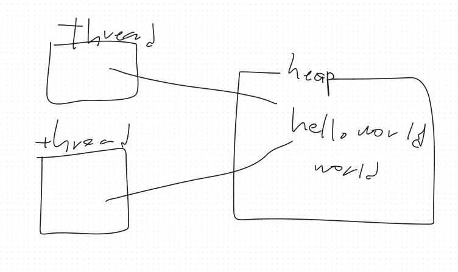

## 아이템 17 변경 가능성을 최소화하라

불변 클래스란 인스턴스 내부 값을 수정할 수 없는 클래스이다 객체가 파괴되는 순간까지 절대 달라지지 않는다 ex) String, BigInteger… 불변 클래스는 가변 클래스보다 설계하고 구현하고 사용하기 쉬우며, 오류가 생길 여지도 적고 훨씬 안전하다

클래스 불변 규칙

1. 객체의 상태를 변경하는 메서드를 제공하지 않는다
    1. Setter사용하지 말라는 뜻
2. 클래스를 확장할 수 없도록 한다
    1. 하위 클래스에서 객체 상태를 변하게하는 사태를 막아준다
    2. 생성자를 private로 잠글 수 있음
3. 모든 필드를 final로 선언한다
    1. final로 설계자의 의도를 명확히 드러낸다 새로 생성된 인스턴스를 동기화 없이 다른 스레드로 건네도 문제없이 동작하게끔 보장하는데도 필요하다
    2. 참고로 필드가 private final이라 해도 무조건 불변은 아니다
        1. 원시타입의 필드는 불변이지만 참조 타입의 필드는 가변일 수 있다
4. 모든 필드를 private로 선언한다
    1. 클라이언트에서 직접 접근해 수정하는 일을 막아준다
5. 자신 외에는 내부의 가변 컴포넌트에 접근할 수 없도록 한다
    1. 방어적 복사는 위에 있습니다

    ```java
    public class Human {
        private final List<Job> history;
    
        public List<Job> getHistory() {
            return history;
        }
    }
    
    ```

   이건 불변 객체일까? private final인데?? 놉 get해서 안에 내용을 변환할 수 있기 때문이다

   필드가 private final이라고 무조건 불변은 아니다 원시 타입의 필드는 불변이지만 참조 타입의 필드는 가변일 수 있다

    ```java
    public class Human {
        private final List<Job> history;
    
        public Human(List<Job> history) {
            this.history = List.copyOf(history);
        }
    
        public List<Job> getHistory() {
            return Collection.unmodifiedList(history);
        }
    }
    ```

   이렇게 하면 방어적 복사가 가능하다


불변 객체는 단순하다 객체의 생성된 시점의 상태를 파괴할때까지 그대로 간직한다 모든 생성자가 불변식을 보장한다면 그 클래스를 사용하는 프로그래머가 다른 노력을 들이지 않더라도 영원히 불변으로 남게 된다

그럼 불변객체는 왜 사용할까?

불변객체는 근본적으로 thread safe하며 따로 동기화할 필요가 없다 불변 객체에 대해서는 그 어떤 스레드도 다른 스레드에 영향을 줄 수 없으니 불변객체는 안심하고 공유할 수 있다

```java
String str = "hello";
String cpy = str;

str = "edit hello";

sout(cpy);
sout(cpy == str);
```

이러면 결과가 어캐될까? new String \n false 이다 왜 와이? String은 Immutable객체기 때문에 값이 변경되는게 아니라 새로운 객체가 생성된다 그러면 Thread safe로 봐보자 불변 객체는

```java
public class WorldAdder extends Thread {
    String value;

    public WorldAdder(String value) {
        this.value = value;
    }

    @Override
    public void run(){
        value += " world";
        System.out.println(value);
    }
}

public static void main(String[] args) {
    String hello = "hello";
    new WorldAdder(hello).start();
    new WorldAdder(hello).start();
}
```


처음에 두 쓰레드는 hello변수를 같이 가르키게 되는데 처음엔 같은 hello를 가르키게 된다

하지만 쓰레드에서 먼저 world를 추가하는 순간


이렇게 새로운 객체를 생성한다

불변 객체가 아니라면?

```java
public class WorldAdder extends Thread {
    StringBuilder value;

    public WorldAdder(StringBuilder value) {
        this.value = value;
    }

    @Override
    public void run(){
        value.append(" world");
        System.out.println(value);
    }
}

public static void main(String[] args) {
    StringBuilder hello = new StringBuilder("hello");
    new WorldAdder(hello).start();
    new WorldAdder(hello).start();
}
```


여기까진 똑같은데 한 쓰레드가 hello world를 하면 쓰레드 둘다


hello world를 가르키고 나머지 쓰레드가 world또 더하면


두 쓰레드 전부 hello world world가 된다

이래서 단점으로는 값이 다르면 독립된 새 인스턴스를 만들어줘야하고 비용이 크다

getter가 있다고 해서 무조건 setter를 만들지 말자(주원 컨벤션 1조1항) 클래스는 꼭 필요한 경우가 아니라면 불변이여야 한다(그럼 JPA에서 자원을 수정 api는?)