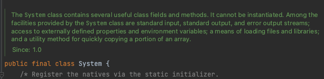

## 아이템 19 상속을 고려해 설계하고 문서화하라 그러지 않았다면 상속을 금지하라

메서드를 재정의하면 어떤일이 일어나는지 정확히 정리하여 문서로 남겨야 한다 상속용 클래스는 재정의할 수 잇는 메서드들을 내부적으로 어떻게 사용하는지 문서로 남겨야 한다 어떤 순서로 호출되는지 각각의 호출 결과가 이어지는 처리에 어떤 영향을 주는지 등등 재정의 가능 메서드를 호출할 수 잇는 모든 상황을 문서로 남겨야 한다 API문서 끝에 Implmentation Requirements로 시작하는 절이 잇는데 그게 메서드의 내부 동작 방식을 설명하는 곳이다

이게 다 상속이 캡슐화를 해치기 떄문에 일어나는 현실이다 @implSpec 태크를 활성화 하려면 명령줄 매개변수로 -tag “implSpec:a:implementation Requirements:”를 지정하며 된다

```java
/**
 * {@inheritDoc}
 *
 * @implSpec
 * This implementation ~~~~~.
 */
```

이렇게 하면


이렇게 잘 나타난다

하지만 문서에 더해서 훅을 사용해야 한다

- 훅: 클래스의 내부 동작 과정에 끼어들 수 잇는 코드
- protected 메서드 형태로 공개
- 직접 하위 클래스를 만들고 검증하는 과정이 필요

```java
public abstract class AbstractList<E> extends AbstractCollection<E> implements List<E> {
...
    public void clear() {
        removeRange(0, size());
    }

...
    protected void removeRange(int fromIndex, int toIndex) {
        ListIterator<E> it = listIterator(fromIndex);
        for (int i = 0, n = toIndex - fromIndex; i < n; i++) {
            it.next();
            it.remove();
        }
    }

...
}
```

우리는 removeRange메서드에 관심이 없다 그래도 제공한 이유는 clear메서드가 고성능을 만들어준다 그러면 상속용 클래스를 설계할떄 어떤 메서드를 protected로 사용해야 할까? 잘 예측해보고 하위 클래스를 만들어서 실험 해보는게 최선이다 protected메서드가 하나하나 내부 구현에 해당하므로 그 수는 가능한 적어야 한다 하지만 또 너무 적게 노출해서 상속으로 얻는 이점마저 없애지 않도록 주의해야 한다

상속용 클래스의 생성자는 직접적으로든 간접적으로든 재정의 가능 메서드를 호출해서는 안된다

```java
class Super {
    public Super() {
        test();
    }

    public void test() {
        System.out.println("super test");
    }
}

class Sub extends Super {
    private String string;

    public Sub() {
        string = "createSub";
    }

    @Override
    public void test() {
        System.out.println(string);
    }
}

class Main {
    public static void main(String[] args) {
        Sub sub = new Sub();
        sub.test();
    }
}
```

null
createSub
sub를 생성하면 생성자에서 Super생성자로 넘어가고 거기에 있는 test()는 동적 바인딩으로 Override된 test로 넘어 간다 근데 그떈 String값이 없어서 null이 나옴

해결 방법 → 각각 재정의 가능 메서드는 자신의 본문 코드를 private 도우미 메서드로 옮기고 이 도우미 메서드를 호출하도록 수정

```java
class Super {
    public Super() {
        methodHelper();
    }

    public void test() {
        methodHelper();
    }
		private void methodHelper() {
				System.out.println("super test");
		}
}

class Sub extends Super {
    private String string;

    public Sub() {
        string = "createSub";
    }

    @Override
    public void test() {
        System.out.println(string);
    }
}

class Main {
    public static void main(String[] args) {
        Sub sub = new Sub();
        sub.test();
    }
}
```

Clonable과 Serializable 인터페이스는 상속용 설계의 어려움을 한층 더해준다 이 클래스를 구현한 클래스를 상속할 수 있게 설계하는 것은 좋지 않다 clone과 readObject는 생성자와 비슷한효과를 낸다(새로운 객체를 만드니까) 그래서 clone과 readObject모두 직접적으로, 간접적으로 재정의 가능 메서드를 호출하면 안된다 클래스의 상태가 초기화되기전에 메서드부터 호출되는 상황이 올 수 있다

상속용으로 설계하지 않은 클래스는 상속을 금지하자.

상속을 금지하는 방법

1. 클래스를 final로 선언
2. 모든 생성자를 private or default로 선언 뒤 public정적 팩터리 메서드 생성